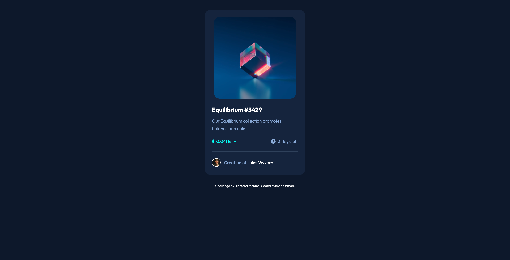
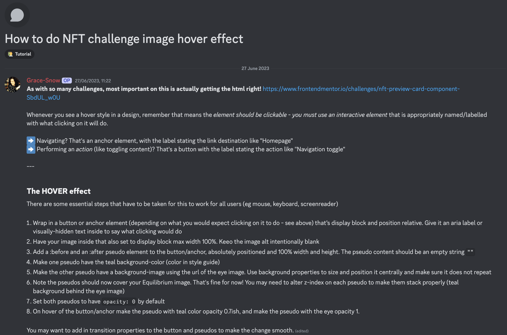

# Frontend Mentor - NFT preview card component solution

This is a solution to the [NFT preview card component challenge on Frontend Mentor](https://www.frontendmentor.io/challenges/nft-preview-card-component-SbdUL_w0U).

## Table of contents

- [Overview](#overview)
- [The task](#the-task)
- [Approach](#approach)
- [Outcome](#outcome)
- [My process](#my-process)
- [Built with](#built-with)
- [Feedback](#feedback)
- [Lessons](#lessons)
- [Take forward](#take-forward)
- [Useful resources](#useful-resources)

## Overview

For this task, I had to design a static page with active states.

## The task

I needed to do this for both Mobile & Desktop and activate the hover states.

## Approach

I used a Mobile-First approach and a CSS Flex layout.

## Outcome

I'm very pleased with the outcome as it's faithful to the design and I built it very quickly and confidently.

:jigsaw: [Live Site URL](https://i000o.github.io/nft-preview-card/)  
:pencil2: [Solution URL](https://www.frontendmentor.io/solutions/nft-preview-card-rLLUexWqBW)

## Built with

:gear: Semantic HTML5 markup  
:gear: CSS Flex  
:gear: Mobile-first workflow

## My process

:alien: First, I planned out my layout and noted down my HTML elements. I enjoy this part and the information hierarchy seems to come quite naturally to me.  
:alien: Then, I styled the page, piece by piece. I did this rapidly, with confidence and a nice flow, which I was really happy with. I enjoyed writing this CSS. I'd like to approach learning Sass next to one-up this skill.  
:alien: Next, I had to implement the active states. This is where I got stumped but I was happy to have a challenge to face-off with so that I could learn something new in this project.  
:alien: I had to create `::before` and `::after` pseudo-elements to make this overlay on hover for the image view. This was my first time really using these and they were a somewhat unclear concept to me prior.  
I was facing a bug where I couldn't get my elements to stack properly to make the overlay function work. I changed my HTML around many times, added `<divs>`, took them away, changed classes... to no end. I researched z-index, reading articles, using Microsoft Edge's 3D view in Dev Tools to find the problem. The key was a lot simpler, in fact. With the help of a Discord contribution on this challenge (see [Useful-resources](#useful-resources)), I understood that I had overlooked some minor changes in my HTML that were fundamental to this function, one of which was to use a `<button>` element instead of an `<a>` tag. Once I had implemented this, I was able to debug and complete the project soon after. This part of the challenge seemed to be something that most new devs struggled with at first, but it was rewarding to overcome it.

## Time taken :alarm_clock:

- Mobile: 1 hr
- Desktop: 8 hrs

## Feedback

## Lessons

1. `::before` and `::after` pseudo-elements. I didn't understand what the 'before' and 'after' really meant before, but now I know that these are states where we can alter or introduce content around an element to appear when an action is taken by the user. I also learnt that in the stacking context, these literally appear (linearly) **before** and **after** in the vertical information flow, so in this case, above and below the containing content. I didn't expect or know this before.
2. `position` properties! I had never really utilised these before and I learnt a lot about `position: relative;` and `position: absolute;` in this context. I also implemented `top`, `bottom`, `left`, `right` properties.
3. `<button>` element - A first for me. I made the mistake of using `<a>` in my HTML initially, where my hover overlay wouldn't work. This was a big moment of clarification.
4. Combining targeting both `pseudo-elements` and `pseudo-classes` at the same time in CSS! (Classes come first).
5. You can import an image via CSS with the `url()` function. They don't always need to be in your HTML, as with the `icon.svg` in this challenge.
6. Solidfying `order` property use in CSS.
7. It was my first time using the `transition` property - really fun.
8. I started to understand stacking contexts and how `z-index` is a comparative relative to other elements within a given stacking context.

## Take forward

:grey_exclamation: I styled this really fast.  
:grey_exclamation: Now I know how to create an icon overlay.  
:grey_exclamation: Pseudo-elements `::before` and `::after`.  
:grey_exclamation: I feel much more confident in basic, static Flex layouts now.  
:grey_exclamation: My first really difficult debug :smile:

## Useful resources

[How to Overlay Icons on Top of Images with CSS](https://dev.to/sanchithasr/how-to-overlay-icons-on-top-of-images-with-css-1kb9)  
[The CSS z-index Property: What You Need to Know](https://blog.hubspot.com/website/z-index)  
[What The Heck, z-index??](https://www.joshwcomeau.com/css/stacking-contexts/)  
Microsoft Edge Dev Tools 3D View Function  

:star:

# nft-preview-card
